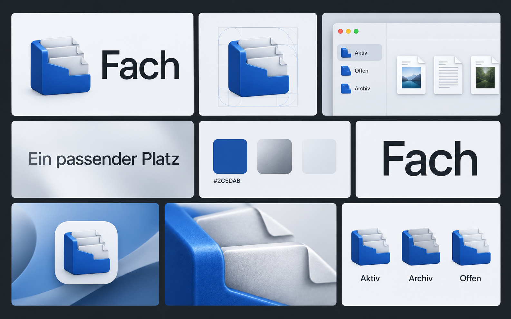

# Fach


<p align="center">
  
</p>

Native macOS-App zum sorgfältigen Aufräumen vorhandener Ordner. Swift und SwiftUI, macOS 26 oder neuer, Apple Silicon.

## Starten

[Vorabversion herunterladen](https://github.com/Maxi139/Fach/releases). Der Download ist ein lokal signierter, noch nicht notarisierter Build.

`build/Fach.app` öffnen oder `build/Fach.dmg` öffnen und Fach in Programme ziehen. Beim ersten Start führt die Einrichtung durch Ordnerwahl und KI-Anbindung. „Beispiel ausprobieren“ erzeugt ausschließlich erfundene Dateien im App-Container.

1. Ordner auswählen, beispielsweise den Schreibtisch.
2. Unterordner nur bei Bedarf einschließen; standardmäßig werden direkte Dateien erfasst.
3. Kurz beschreiben, was gerade wichtig ist.
4. Analysieren. Bei Cloudanalyse wird jede Freigabe pro Lauf eingeholt.
5. Datei auswählen, Zielordner prüfen und mit „Zuordnung bestätigen“ freigeben. „Sortieren“ verschiebt die freigegebenen und sicheren Dateien.
6. Änderungen im Verlauf einzeln oder als Lauf rückgängig machen.

Analysen und bestätigte Zuordnungen werden lokal gespeichert. Nach einem Neustart kannst du ohne erneute KI-Analyse weiterprüfen. Inzwischen geänderte Dateien brauchen eine neue Bestätigung.

Vorhandene Zielordner haben Vorrang. Ergänzende Ordner entstehen erst, wenn sie gebraucht werden. Ein größerer Strukturvorschlag braucht belegte Schwächen und zwei getrennte Nutzerbestätigungen. Bestehende Ordner werden nicht gelöscht oder als Ganzes verschoben.

## KI einrichten

**Nur lokal:** Ollama von https://ollama.com/download/mac installieren und einmal öffnen. Fach erkennt den laufenden Dienst oder startet die installierte App. Alternativ versucht es eine vorhandene Ollama-CLI zu starten. In Einstellungen → Lokal stehen Modellwahl und Downloads mit Fortschritt zur Verfügung. Standard: `llava:7b` für Bilder und `qwen3:1.7b` für Text. Modell-Downloads brauchen Internet; die anschließende lokale Analyse kann offline laufen. Lokale Zuordnungen werden vom Nutzer geprüft. Kleine Modelle können Inhalte falsch beschreiben oder unpassende Ziele vorschlagen; diese Vorschläge werden nicht automatisch ausgeführt.

**Hybrid:** Ein OpenRouter-Konto, Guthaben und API-Key werden benötigt. Die Anleitung in der App verlinkt Konto, Guthaben und Key-Verwaltung. Der Key wird im macOS-Schlüsselbund gespeichert. Jev entscheidet strukturiert über vorhandene Zielordner und Wichtigkeit; ein günstiges konfigurierbares Textmodell schlägt Namen vor. Bilder werden bevorzugt lokal beschrieben. Cloud-Bildanalyse ist nur mit Inhaltsfreigabe erlaubt. Standardbudget: 0,10 USD pro Lauf. Preisprüfung, Reservierung vor Anfragen und keine automatischen bezahlten Wiederholungen.

Nur-lokal für einen einzelnen Lauf ändert die gespeicherte Hybrid-Einstellung nicht. Cloudfreigabe nennt Empfänger und übertragene Angaben. Textauszüge und verkleinerte Bilder lassen sich ausschließen; Dateinamen, lokale Beschreibungen, Zielordner und das Vorhaben bleiben bei Cloudanalyse notwendige Eingaben.

## Dateisicherheit

- Keine Überschreibung bei Namenskollisionen.
- Projektordner, Pakete, Bibliotheken, Symlinks und nicht geladene iCloud-Dateien werden geschützt oder übersprungen.
- Identität, Größe, Änderungszeit und vollständige Inhaltsprüfung vor Dateioperationen.
- SQLite-Journal mit Wiederaufnahme nach Unterbrechung.
- Papierkorb nur nach Bestätigung. Vorher entsteht eine dauerhaft geprüfte Wiederherstellungskopie im App-Container. Bei unbekanntem Papierkorb-Ziel kann Rückgängig diese Kopie verwenden; eine zusätzliche Kopie im Papierkorb bleibt dann eventuell bestehen.
- Rückgängig überschreibt keine inzwischen vorhandenen oder geänderten Dateien. Konflikte bleiben sichtbar und erneut prüfbar.
- Kein dauerhaftes Löschen. Kein automatisches Verschieben ganzer Verzeichnisse oder zyklischer Umbenennungen.

Analyse verarbeitet begrenzte Textauszüge, bis zu acht PDF-Seiten, Bilder bis 32 MB und JPEG-Vorschauen bis 1024 Pixel. Nicht lesbare Dateitypen bleiben manuell zuzuordnen. Wichtigkeit ist eine Vorschlagseinschätzung und wird durch das Nutzer-Vorhaben beeinflusst.

## Entwicklung

GitHub Actions führt Tests mit erfundenen Dateien und simulierten KI-Antworten aus. Zugangsdaten werden nicht benötigt. Erfolgreiche Läufe stellen einen DMG-Build als Artefakt bereit.

```sh
swift test
swift run Fach --demo
bash scripts/build-app.sh
bash scripts/package-dmg.sh
```

Swift 6.2+ und macOS-26-SDK erforderlich. Keine externen Swift-Abhängigkeiten; SQLite kommt vom System.

`FACH_SIGN_IDENTITY` setzt die Signaturidentität. Ohne diese Variable entsteht ein lokal ad-hoc signierter Sandbox-Build. Für öffentliche Verteilung sind Developer-ID-Signatur und Apple-Notarisierung erforderlich. `FACH_NOTARY_PROFILE` aktiviert die Notarisierung beim DMG-Bau. Der mitgelieferte lokale Build ist nicht notarisiert.

## Prüfnachweise

52 automatisierte Tests für Scanner, Dateioperationen, Journal, Wiederherstellung, Kollisionen, Budget, Modellantworten und Datenschutz. Native UI-Prüfung mit erfundenen Beispieldateien: Sortieren und Rückgängig, lokale Ollama-Erreichbarkeit und lokale Text- und Bildanalyse in einem ausgewählten Ordner außerhalb des App-Containers sowie Papierkorb und Wiederherstellung. Cloudintegration wird mit simuliertem Transport geprüft; kein bezahlter Lauf mit privaten Nutzerdateien durchgeführt.

## Gestaltung

Systemschrift, native macOS-Fenster, Sidebar, Inspector, Quick Look, Tastaturzugriff und reduzierte Bewegung. Logo in `Brand/FachIcon.png`; Brandkit in `Brand/Fach-Brandkit.png`. Das Brandkit ist ein visueller Entwurf, kein Screenshot der fertigen App.
